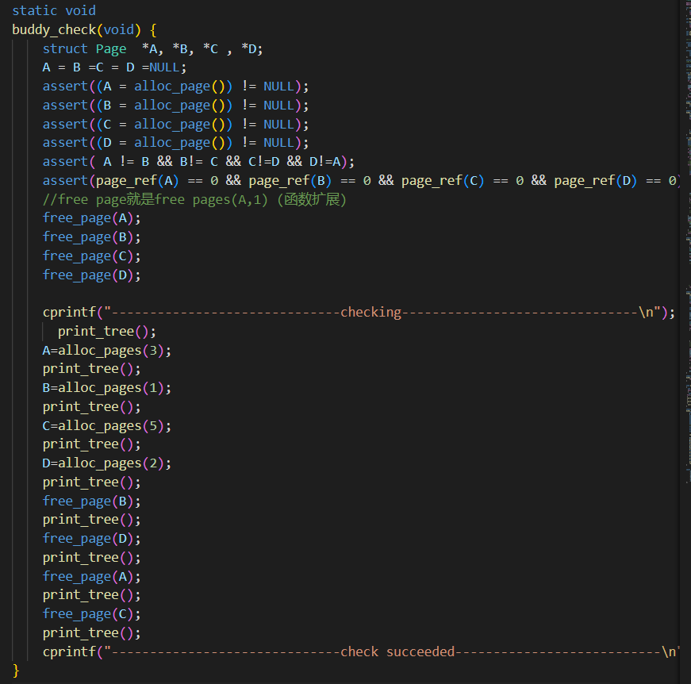

### Buddy System 设计文档

Buddy System算法把系统中的可用存储空间划分为存储块(Block)来进行管理, 每个存储块的大小必须是2的n次幂(Pow(2, n)), 即1, 2, 4, 8, 16, 32, 64, 128...

#### buddy system 数据结构


其中，`longest[1]`也可以直接写成`longest`，对于接下来的代码实现并无影响。

定义`struct buddy2 tree[80000];`， 即数组形式的完全二叉树。由于分配的n为3w2，而树结构需要的节点数为两倍，因此节点数大小设置为8w


#### 已分配块信息数据结构


利用该数据结构来记录已分配块的信息，在释放块时可以提升查找速率。

定义`struct allocBlock block[80000]; `与 `int blockNum;`，分配块数据结构的大小与二叉树节点数一致，`blockNum`记录已分配块的总数。


#### 相关工具函数

判断是否是2次幂
  ```
    int IS_POWER_OF_2(int n){
        int i;
        for(i=1;i<n;i*=2);
        return n==i ? 1 : 0;
    }
  ```

调整为比n大的最小的2次幂数
  ```
    int MIN_BLOCK(int n){ //找到比n大的最小的2^k块
    int i=1;
    for(i;i<n;i*=2);
    return i;
    }
  ```

#### 初始化buddy2数据结构
整个分配器的大小就是满二叉树节点数目，即所需管理内存单元数目的2倍。一个节点对应4个字节，longest记录了节点所对应的的内存块大小。


#### 初始化内存映射

将每一页都初始化为大小为1的页，便于每个叶节点管理。


#### buddy分配过程


先调整所需内存大小，将其调整为2的次幂。

从根节点开始往下查询，看左右子树的内存是否符合要求，如果都符合要求则选择更小的那个。将该节点的`longest`置为0，表示已被使用。（该节点的下层节点不用修改，因为该节点为管理内存置0后，搜索时不会考虑它再下一层的节点了）同时记录该节点的偏移量。

向上回溯更新父节点的内存使用情况，将父节点的可用内存值设置为左右子树的最大值。

返回值即为该分配节点的偏移量。offset即为要分配的叶节点的起始地址

#### 页的分配


调用`buddy2_alloc`函数获取要分配的节点的偏移量，记录在`allocBlock`中，方便后续的释放。

根据所得的偏移量定位到对应的页地址，标记该页面，表示从此处开始分配页。并将该页面记录在`allocBlock`中。

将分配页数量调整为2的次幂，并记录在`allocBlock`中。把页合并为大小为n的一个大页，重新设置页首、页容量等信息。由于合并为了一页，因此该页地址后续的页需清空，并更新空闲页总数。最后更新页首的容量。

#### 页的释放


根据base在已分配块结构体中遍历寻找要释放的块信息，获取叶节点的偏移量及页大小。

确保偏移量的有效性后，计算出该节点的左边叶节点的坐标，将其置为1。


根据叶节点的偏移量迭代寻找当时分配的页，再将其逐一收回：将flag置为0，表示未被使用；将容量大小置为1，且每页都置为页首，还原状态。


从叶节点开始逐层向上回溯，每层的`node_size`都变为当前的两倍。当左右子树的值等于原空闲块满状态的大小时，将该节点的`longest`恢复为满状态的值；否则，该节点的`longest`设置为左右子树中值更大的那个。


删除记录的分配块信息，将结构体数组后面的部分前移，并更新`blockNum`的大小。


#### 测试样例
修改初始化内存大小
- 为了在测试时便于验证正确性，找到`pmm.c`文件中`page_init`函数中调用的`init_memmap`函数，将传入的内存大小设置为16。
- `init_memmap(pa2page(mem_begin), 16); `

测试样例的选择
- 选择逐次分配大小为3/1/5/2的块，再依次释放大小为1/2/3/5的块。
- 分配完成后，内存块分布应为3/1/2/5
- 释放1和2的块后，这两个块合并为大小为4的块；释放3的块时，进行第二次合并；最后释放5的块时，内存合并为一整个大块。

代码实现

- 测试代码如下所示
- 
    - 由于函数扩展，`free page`即为`free pages(A,1)`
    - 每次分配和释放结束后，都将二叉树数组打印出来验证。

实验验证
- 分配    
    - 
    - 在进行分配之前，二叉树数组为满状态
    - 分配大小为3的块后，块大小扩展为4，因此最左边的为4的节点被置为0，祖先节点的值也相应被更新。
    - 分配大小为1的块后，根节点的右子树的最左叶节点的值置为0。
- 释放
    - 

