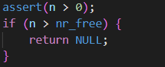

### 练习

对实验报告的要求：
 - 基于markdown格式来完成，以文本方式为主
 - 填写各个基本练习中要求完成的报告内容
 - 完成实验后，请分析ucore_lab中提供的参考答案，并请在实验报告中说明你的实现与参考答案的区别
 - 列出你认为本实验中重要的知识点，以及与对应的OS原理中的知识点，并简要说明你对二者的含义，关系，差异等方面的理解（也可能出现实验中的知识点没有对应的原理知识点）
 - 列出你认为OS原理中很重要，但在实验中没有对应上的知识点

#### 练习0：填写已有实验

本实验依赖实验1。请把你做的实验1的代码填入本实验中代码中有“LAB1”的注释相应部分并按照实验手册进行进一步的修改。具体来说，就是跟着实验手册的教程一步步做，然后完成教程后继续完成完成exercise部分的剩余练习。

#### 练习1：理解first-fit 连续物理内存分配算法（思考题）
first-fit 连续物理内存分配算法作为物理内存分配一个很基础的方法，需要同学们理解它的实现过程。请大家仔细阅读实验手册的教程并结合`kern/mm/default_pmm.c`中的相关代码，认真分析default_init，default_init_memmap，default_alloc_pages， default_free_pages等相关函数，并描述程序在进行物理内存分配的过程以及各个函数的作用。
请在实验报告中简要说明你的设计实现过程。请回答如下问题：
- 你的first fit算法是否有进一步的改进空间？

- `default_init`
  - 初始化空链表，初始化空闲页数
  - `list_init(&free_list);` 初始化空链表
  - `nr_free = 0;` 将空闲页数置为0

- `default_init_memmap`
  - 初始化一段物理页面的内存映射，并将其添加到空闲页面列表中。
  - 
    - 这个函数接受一个指向页面数组的指针 `base` 和页面数量 `n`。函数会遍历这些页面，将它们的标志、属性和引用计数初始化为0，并将第一个页面的 `property` 字段设置为 `n`，表示这些页面组成了一个空闲页面块。函数会将这个页面块添加到空闲页面列表中。
    - 函数会更新空闲页面数量 `nr_free`，表示系统中当前的空闲页面数量增加了`n`。
  - 
    - 如果空闲页面列表为空，函数会直接将这个页面块添加到列表中。否则，函数会遍历空闲页面列表，找到合适的位置将这个页面块插入其中。(按照地址顺序来找)

- `default_alloc_pages`
  - 分配 n 个物理页面，并返回它们的 `Page` 结构体指针。如果没有足够的空闲页面，则返回 `NULL`。
  - 
    - 首先检查系统中是否有足够的空闲页面。如果可用页面数量小于 n，则返回 NULL，表示无法分配所需的页面。
  - 
    - 如果存在足够的空闲页面，则函数会遍历空闲页面列表，找到第一个可以满足需求的页面块。
      - 如果找到一个页面块的空闲页面数量大于等于 n，则将其分配给请求者，并更新空闲页面列表和空闲页面数量。
    - 如果找到的页面块中有多余的页面，则将多余的页面从页面块中分离出来，并将其添加到空闲页面列表中。这样可以确保页面块中剩余的页面仍然可以被其他请求使用
  - 最后，函数会返回分配的页面块的 Page 结构体指针。如果无法分配页面，则返回 NULL。

- `default_free_pages`
  - 释放一段物理页面，并将其加入到空闲页面列表中。
  - 
    - 更新每页的状态，恢复首页的大小，并将base设置为页首，空闲页表数量+n
  - 
    - 把页加入到空闲页链表中（与初始化时一样）
  - 
    - 若与上一页地址连续，则合并为一个页
  - 
    - 若与下一页地址连续，则合并为一个页
  
- first-fit算法的改进空间
  - 使用更高效的数据结构来管理空闲页面列表
    - 当前的实现中使用了一个循环链表来存储空闲页面，但在查找合适的页面块时需要遍历整个链表。可以考虑使用其他数据结构，如二叉搜索树或红黑树，来加速查找过程。
  - 引入内存合并的机制
    - 在分配页面后，可能会产生一些难以被利用的小块，并作为小的一页链入空闲链表中。可以将这些小块与相邻地址的大页合并，提高利用率

#### 练习2：实现 Best-Fit 连续物理内存分配算法（需要编程）
在完成练习一后，参考kern/mm/default_pmm.c对First Fit算法的实现，编程实现Best Fit页面分配算法，算法的时空复杂度不做要求，能通过测试即可。
请在实验报告中简要说明你的设计实现过程，阐述代码是如何对物理内存进行分配和释放，并回答如下问题：
- 你的 Best-Fit 算法是否有进一步的改进空间？

- 在best-fit算法中，我们需要记录当前找到的满足需求的最小空闲页的大小和对应的空闲页指针。在遍历空闲页链表时，如果找到一个满足需求且比当前最小空闲页还要小的空闲页，就更新最小空闲页的大小和指针。最后返回最小空闲页的指针。
- `best_fit_alloc_pages`
  - 
  - 用min_size记录当前最小空闲页面，初始值比现有所有页面数大。迭代寻找最小的页面。

- Best-Fit 算法的进一步改进空间
  - 将链表排序方式改为按页大小排序
    - 由于现在链表按地址顺序排序，因此遍历时需要遍历一整个链表。可以改为按照页大小从小到大排序。这样找到第一个比n大的页面时即可停止遍历，减少分配页时的时间复杂度。

#### 扩展练习Challenge：buddy system（伙伴系统）分配算法（需要编程）

Buddy System算法把系统中的可用存储空间划分为存储块(Block)来进行管理, 每个存储块的大小必须是2的n次幂(Pow(2, n)), 即1, 2, 4, 8, 16, 32, 64, 128...

 -  参考[伙伴分配器的一个极简实现](http://coolshell.cn/articles/10427.html)， 在ucore中实现buddy system分配算法，要求有比较充分的测试用例说明实现的正确性，需要有设计文档。
 
- 设计文档查看buddy_system.md

#### 扩展练习Challenge：任意大小的内存单元slub分配算法（需要编程）

slub算法，实现两层架构的高效内存单元分配，第一层是基于页大小的内存分配，第二层是在第一层基础上实现基于任意大小的内存分配。可简化实现，能够体现其主体思想即可。

 - 参考[linux的slub分配算法/](http://www.ibm.com/developerworks/cn/linux/l-cn-slub/)，在ucore中实现slub分配算法。要求有比较充分的测试用例说明实现的正确性，需要有设计文档。

#### 扩展练习Challenge：硬件的可用物理内存范围的获取方法（思考题）
  - 如果 OS 无法提前知道当前硬件的可用物理内存范围，请问你有何办法让 OS 获取可用物理内存范围？

- 使用BIOS提供的ACPI（高级配置和电源管理接口）信息
  - ACPI是一种标准接口，可以向操作系统提供诸如内存映射、设备信息、电源管理等信息。在启动过程中，BIOS会收集系统硬件信息并将其存储在ACPI表中，操作系统可以通过解析ACPI表来获取系统信息，包括可用物理内存范围。
  - BIOS中断可以返回已安装的硬件信息，由于BIOS及其中断也只是一组软件，它要访问硬件也要依靠硬件提供的接口，所以，获取内存信息，其内部是通过连续调用硬件的应用程序接口(API)来获取内存信息的。
  - 中断 ***0x15*** 子功能 ***0xe820***
    - 这个子功能能够获取系统的内存布局，由于系统内存各部分的类型属性不同，BIOS就按照类型属性来划分这片系统内存，所以这种查询呈迭代式，每次BIOS只返回一种类型的内存信息，直到将所有内存类型返回完毕。
    - 内存信息的内容是用地址范围描述符来描述的，用于存储这种描述符的结构称之为地址范围描述符(ARDS)
    - 		
      | 字节偏移量 | 属性名称| 描述|
      | - | - | - |
      |0|	BaseAddrLow |	基地址的低32位 |
      | 4	| BaseAddrHigh |	基地址的高32位 |
      | 8 |	LengthLow	 | 内存长度的低32位，单位字节 |
      | 12	| LengthHigh |	内存长度的高32位，单位字节 |
      | 16	| Type	| 本段内存的类型 |

- 通过物理内存映射寻找可用物理内存范围。
  - 在x86架构中，物理内存地址范围是0~4GB，但不是所有的物理地址都可以用来访问内存。有些地址可能被硬件设备或BIOS保留，无法访问。可以通过物理内存映射表（Physical Address Extension，PAE）来查找可用的物理内存范围。
- 使用UEFI（统一可扩展固件接口）提供的信息。
  - UEFI是一种新的固件接口，可以取代传统的BIOS接口。UEFI提供了一些API来获取系统信息，包括可用物理内存范围。

> Challenges是选做，完成Challenge的同学可单独提交Challenge。完成得好的同学可获得最终考试成绩的加分。