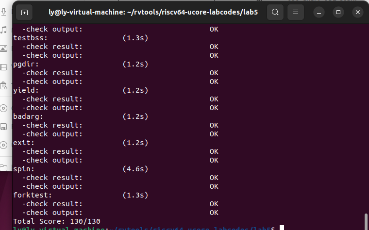

### 练习 

对实验报告的要求：
 - 基于markdown格式来完成，以文本方式为主
 - 填写各个基本练习中要求完成的报告内容
 - 完成实验后，请分析ucore_lab中提供的参考答案，并请在实验报告中说明你的实现与参考答案的区别
 - 列出你认为本实验中重要的知识点，以及与对应的OS原理中的知识点，并简要说明你对二者的含义，关系，差异等方面的理解（也可能出现实验中的知识点没有对应的原理知识点）
 - 列出你认为OS原理中很重要，但在实验中没有对应上的知识点
 


#### 练习0：填写已有实验 

本实验依赖实验1/2/3/4。请把你做的实验1/2/3/4的代码填入本实验中代码中有“LAB1”/“LAB2”/“LAB3”/“LAB4”的注释相应部分。注意：为了能够正确执行lab5的测试应用程序，可能需对已完成的实验1/2/3/4的代码进行进一步改进。

#### 练习1: 加载应用程序并执行（需要编码） 

**do\_execv**函数调用`load_icode`（位于kern/process/proc.c中）来加载并解析一个处于内存中的ELF执行文件格式的应用程序。你需要补充`load_icode`的第6步，建立相应的用户内存空间来放置应用程序的代码段、数据段等，且要设置好`proc_struct`结构中的成员变量trapframe中的内容，确保在执行此进程后，能够从应用程序设定的起始执行地址开始执行。需设置正确的trapframe内容。

请在实验报告中简要说明你的设计实现过程。
- 请简要描述这个用户态进程被ucore选择占用CPU执行（RUNNING态）到具体执行应用程序第一条指令的整个经过。

##### `load_icode`:
- 调用mm_create函数来申请进程的内存管理数据结构mm所需内存空间，并对mm进行初始化；
- 调用setup_pgdir来申请一个页目录表所需的一个页大小的内存空间，并把描述ucore内核虚空间映射的内核页表（boot_pgdir所指）的内容拷贝到此新目录表中，最后让mm->pgdir指向此页目录表，这就是进程新的页目录表了，且能够正确映射内核虚空间；
- 根据应用程序执行码的起始位置来解析此ELF格式的执行程序，并调用mm_map函数根据ELF格式的执行程序说明的各个段（代码段、数据段、BSS段等）的起始位置和大小建立对应的vma结构，并把vma插入到mm结构中，从而表明了用户进程的合法用户态虚拟地址空间；
- 调用根据执行程序各个段的大小分配物理内存空间，并根据执行程序各个段的起始位置确定虚拟地址，并在页表中建立好物理地址和虚拟地址的映射关系，然后把执行程序各个段的内容拷贝到相应的内核虚拟地址中，至此应用程序执行码和数据已经根据编译时设定地址放置到虚拟内存中了；
- 需要给用户进程设置用户栈，为此调用mm_mmap函数建立用户栈的vma结构，明确用户栈的位置在用户虚空间的顶端，大小为256个页，即1MB，并分配一定数量的物理内存且建立好栈的虚地址<—>物理地址映射关系；
- 至此,进程内的内存管理vma和mm数据结构已经建立完成，于是把mm->pgdir赋值到cr3寄存器中，即更新了用户进程的虚拟内存空间，此时的initproc已经被hello的代码和数据覆盖，成为了第一个用户进程，但此时这个用户进程的执行现场还没建立好；
- 先清空进程的中断帧，再重新设置进程的中断帧，使得在执行中断返回指令“iret”后，能够让CPU转到用户态特权级，并回到用户态内存空间，使用用户态的代码段、数据段和堆栈，且能够跳转到用户进程的第一条指令执行，并确保在用户态能够响应中断；

##### 设计过程：
```c
//设置中断帧
    //(6) setup trapframe for user environment
    //指向当前进程tf
    struct trapframe *tf = current->tf;
    // Keep sstatus
    uintptr_t sstatus = tf->status;
    //清零，以便为用户重新设置
    memset(tf, 0, sizeof(struct trapframe));
    //sp栈顶为用户栈栈顶
    tf->gpr.sp=USTACKTOP;
    //异常程序计数器设为用户诚如入口点
    tf->epc= elf->e_entry;
    //是要清除这两位
    //SPP当前特权级别，SPIE之前特权级别是否使用中断
    //确保在返回用户态时，特权级别和中断使能被正确设置
    tf->status=read_csr(sstatus) & ~SSTATUS_SPP & ~SSTATUS_SPIE;
    ret = 0;
    //这段代码的作用是为用户环境设置陷阱帧，
    //以便在用户程序从内核返回到用户模式时能够正确地恢复执行。
```

#### 用户进程被调用经过
用户态进程被ucore选择占用CPU执行（RUNNING态）到具体执行应用程序第一条指令的整个经过：
- 调用schedule函数，调度器占用了CPU的资源之后，用户态进程调用了exec系统调用，从而转入到了系统调用的处理例程；
- 之后进行正常的中断处理例程，然后控制权转移到了syscall.c中的syscall函数，然后根据系统调用后转移给了sys_exec函数，在该函数中调用了do_execve函数来完成指定应用程序的加载；
- 在do_execve中进行了若干设置，包括退出当前进程的页表，换用内核的PDT，调用load_icode函数完成对整个用户线程内存空间的初始化，包括堆栈的设置以及将ELF可执行文件的加载，之后通过current->tf指针修改了当前系统调用的trapframe，使得最终中断返回的时候能够切换到用户态，并且同时可以正确地将控制权转移到应用程序的入口处；
- 在完成了do_exec函数之后，进行正常的中断返回的流程，由于中断处理例程的栈上面的eip已经被修改成了应用程序的入口处，是用户态，因此进行中断返回的时候会将堆栈切换到用户的栈，并且完成特权级的切换，并且跳转到要求的应用程序的入口处；
- 开始执行应用程序的第一条代码


#### 练习2: 父进程复制自己的内存空间给子进程（需要编码） 

创建子进程的函数`do_fork`在执行中将拷贝当前进程（即父进程）的用户内存地址空间中的合法内容到新进程中（子进程），完成内存资源的复制。具体是通过`copy_range`函数（位于kern/mm/pmm.c中）实现的，请补充`copy_range`的实现，确保能够正确执行。

请在实验报告中简要说明你的设计实现过程。

- 如何设计实现`Copy on Write`机制？给出概要设计，鼓励给出详细设计。

> Copy-on-write（简称COW）的基本概念是指如果有多个使用者对一个资源A（比如内存块）进行读操作，则每个使用者只需获得一个指向同一个资源A的指针，就可以该资源了。若某使用者需要对这个资源A进行写操作，系统会对该资源进行拷贝操作，从而使得该“写操作”使用者获得一个该资源A的“私有”拷贝—资源B，可对资源B进行写操作。该“写操作”使用者对资源B的改变对于其他的使用者而言是不可见的，因为其他使用者看到的还是资源A。

##### 设计实现过程：
```c
            //src_kvaddr=page2kva(page)
            //dst_kvaddr=page2kva(npage)
            memcpy(page2kva(npage), page2kva(page), PGSIZE);
            //调用page_insert函数将线性地址（la）和物理地址（pa）建立映射关系，并将映射关系添加到PDT（pgdir）中
            ret = page_insert(to, npage, start, perm);

            assert(ret == 0);
```
##### copy-on-write机制
首先，Copy on Write 是在复制一个对象的时候并不是真正的把原先的对象复制到内存的另外一个位置上，而是在新对象的内存映射表中设置一个指针，指向源对象的位置，并把那块内存的Copy-On-Write位设置为1。通俗来说一下这样做的好处：如果复制的对象只是对内容进行"读"操作，那其实不需要真正复制，这个指向源对象的指针就能完成任务，这样便节省了复制的时间并且节省了内存。但是问题在于，如果复制的对象需要对内容进行写的话，单单一个指针可能满足不了要求，因为这样对内容的修改会影响其他进程的正确执行，所以就需要将这块区域复制一下，当然不需要全部复制，只需要将需要修改的部分区域复制即可，这样做大大节约了内存并提高效率。

因为如果设置原先的内容为只可读，则在对这段内容进行写操作时候便会引发Page Fault，这时候我们便知道这段内容是需要去写的，在Page Fault中进行相应处理即可。也就是说利用Page Fault来实现权限的判断，或者说是真正复制的标志。

基于原理和之前的用户进程创建、复制、运行等机制进行分析，设计思想：

- 设置一个标记位，用来标记某块内存是否共享，实际上dup_mmap函数中有对share的设置，因此首先需要将share设为1,表示可以共享。
- 在pmm.c中为copy_range添加对共享页的处理，如果share为1，那么将子进程的页面映射到父进程的页面即可。由于两个进程共享一个页面之后，无论任何一个进程修改页面，都会影响另外一个页面，所以需要子进程和父进程对于这个共享页面都保持只读。
- 当程序尝试修改只读的内存页面的时候，将触发Page Fault中断，这时候我们可以检测出是超出权限访问导致的中断，说明进程访问了共享的页面且要进行修改，因此内核此时需要重新为进程分配页面、拷贝页面内容、建立映射关系

 
#### 练习3: 阅读分析源代码，理解进程执行 fork/exec/wait/exit 的实现，以及系统调用的实现（不需要编码） 

请在实验报告中简要说明你对 fork/exec/wait/exit函数的分析。并回答如下问题：
 - 请分析fork/exec/wait/exit的执行流程。重点关注哪些操作是在用户态完成，哪些是在内核态完成？内核态与用户态程序是如何交错执行的？内核态执行结果是如何返回给用户程序的？
 - 请给出ucore中一个用户态进程的执行状态生命周期图（包执行状态，执行状态之间的变换关系，以及产生变换的事件或函数调用）。（字符方式画即可）


执行：make grade。如果所显示的应用程序检测都输出ok，则基本正确。（使用的是qemu-1.0.1）



1. do_fork

    调用alloc_proc，首先获得一块用户信息块。
    调用setup_kstack为进程分配一个内核栈。
    调用copy_mm复制原进程的内存管理信息到新进程（但内核线程不必做此事）
    调用copy_thread复制原进程上下文到新进程
    调用hash_proc和set_links将新进程添加到进程列表hash_list和proc_list中
    调用wakeup_proc唤醒新进程
    返回新进程号ret(proc->id)

2. do_execve

    do_execve函数做的事请比较简单
        检查当前进程所分配的内存区域是否存在异常。
        回收当前进程的所有资源，包括已分配的内存空间/页目录表等等。
        读取可执行文件，并根据ELFheader分配特定位置的虚拟内存，并加载代码与数据至特定的内存地址，最后分配堆栈并设置trapframe属性。
        设置新进程名称。

    该函数几乎释放原进程所有的资源，除了PCB。也就是说，do_execve保留了原进程的PID、原进程的属性、原进程与其他进程之间的关系等等。


3. do_wait
    do_wait程序会使某个进程一直等待，直到（特定）子进程退出后，该进程才会回收该子进程的资源并函数返回。该函数的具体操作如下：

        检查当前进程所分配的内存区域是否存在异常。

        查找特定/所有子进程中是否存在某个等待父进程回收的子进程（

            如果有，则回收该进程并函数返回。
            如果没有，则设置当前进程状态为PROC_SLEEPING并执行schedule调度其他进程运行。当该进程的某个子进程结束运行后，当前进程会被唤醒，并在do_wait函数中回收子进程的PCB内存资源。

4. do_exit
该函数与do_execve/do_wait函数中的进程回收代码类似，但又有所不同。其具体操作如下：

    ·回收所有内存（除了PCB，该结构只能由父进程回收）

    设置当前的进程状态为PROC_ZOMBIE

    设置当前进程的退出值current->exit_code。

    如果有父进程，则唤醒父进程，使其准备回收该进程的PCB。

        正常情况下，除了initproc和idleproc以外，其他进程一定存在父进程。

    如果当前进程存在子进程，则设置所有子进程的父进程为initproc。这样倘若这些子进程进入结束状态，则initproc可以代为回收资源。

    执行进程调度。一旦调度到当前进程的父进程，则可以马上回收该终止进程的PCB。


#### 扩展练习 Challenge
1. 实现 Copy on Write  （COW）机制 

    给出实现源码,测试用例和设计报告（包括在cow情况下的各种状态转换（类似有限状态自动机）的说明）。

    这个扩展练习涉及到本实验和上一个实验“虚拟内存管理”。在ucore操作系统中，当一个用户父进程创建自己的子进程时，父进程会把其申请的用户空间设置为只读，子进程可共享父进程占用的用户内存空间中的页面（这就是一个共享的资源）。当其中任何一个进程修改此用户内存空间中的某页面时，ucore会通过page fault异常获知该操作，并完成拷贝内存页面，使得两个进程都有各自的内存页面。这样一个进程所做的修改不会被另外一个进程可见了。请在ucore中实现这样的COW机制。

    由于COW实现比较复杂，容易引入bug，请参考 https://dirtycow.ninja/  看看能否在ucore的COW实现中模拟这个错误和解决方案。需要有解释。

    这是一个big challenge.

2. 说明该用户程序是何时被预先加载到内存中的？与我们常用操作系统的加载有何区别，原因是什么？


#### 实现思路：

​ 当一个用户父进程创建自己的子进程时，父进程会把其申请的用户空间设置为只读，子进程可共享父进程占用的用户内存空间中的页面。当其中任何一个进程修改此用户内存空间中的某页面时，ucore会通过page fault异常获知该操作，并完成拷贝内存页面，使得两个进程都有各自的内存页面。这样一个进程所做的修改不会被另外一个进程可见了。

    设置一个标记位，用来标记某块内存是否共享，dup_mmap函数中有对share的设置，因此首先需要将share设为1,表示可以共享。
    在pmm.c中为copy_range添加对共享页的处理，如果share为1，那么将子进程的页面映射到父进程的页面。由于两个进程共享一个页面之后，无论任何一个进程修改页面，都会影响另外一个页面，所以需要子进程和父进程对于这个共享页面都保持只读。
    当程序尝试修改只读的内存页面的时候，将触发Page Fault中断，这时候我们可以检测出是超出权限访问导致的中断，进程访问了共享的页面且要进行修改，因此内核此时需要重新为进程分配页面、拷贝页面内容、建立映射关系.

#### 代码实现：

1. copy_range:

​ 当进行内存访问时，CPU会根据PTE上的读写位PTE_P、PTE_W来确定当前内存操作是否允许，如果不允许，则缺页中断。我们可以在copy_range函数中，将父进程中所有PTE中的PTE_W置为0，这样便可以将父进程中所有空间都设置为只读。然后使子进程的PTE全部指向父进程中PTE存放的物理地址，这样便可以达到内存共享的目的。

```c
int copy_range(pde_t *to, pde_t *from, uintptr_t start, uintptr_t end, bool share) {
    assert(start % PGSIZE == 0 && end % PGSIZE == 0);
    assert(USER_ACCESS(start, end));
    // copy content by page unit.
    do {
        //call get_pte to find process A's pte according to the addr start
        pte_t *ptep = get_pte(from, start, 0), *nptep;
        if (ptep == NULL) {
            start = ROUNDDOWN(start + PTSIZE, PTSIZE);
            continue ;
        }
        //call get_pte to find process B's pte according to the addr start. If pte is NULL, just alloc a PT
        if (*ptep & PTE_P) {
            if ((nptep = get_pte(to, start, 1)) == NULL)
                return -E_NO_MEM;
            uint32_t perm = (*ptep & PTE_USER);
            //get page from ptep
            struct Page *page = pte2page(*ptep);
            int ret = 0;
            // 如果启用写时复制
            if(share)
            {
                cprintf("Sharing the page 0x%x\n", page2kva(page));
                // 物理页面共享，并设置两个PTE上的标志位为只读
                page_insert(from, page, start, perm & ~PTE_W);
                ret = page_insert(to, page, start, perm & ~PTE_W);
            }
            // 完整拷贝内存
            else
            {
                // alloc a page for process B
                // 目标页面地址
                struct Page *npage = alloc_page();
                assert(page!=NULL);
                assert(npage!=NULL);
                cprintf("alloc a new page 0x%x\n", page2kva(npage));
                void * kva_src = page2kva(page);
                void * kva_dst = page2kva(npage);
                memcpy(kva_dst, kva_src, PGSIZE);
                // 将目标页面地址设置到PTE中
                ret = page_insert(to, npage, start, perm);
            }
            assert(ret == 0);
        }
        start += PGSIZE;
    } while (start != 0 && start < end);
    return 0;
}

```


2. do_pgfault：

​ 当某个进程想写入一个共享内存时，由于PTE上的PTE_W为0，所以会触发缺页中断处理程序。此时进程需要在缺页中断处理程序中复制该页内存，并设置该页内存所对应的PTE_W为1。

```c
int do_pgfault(struct mm_struct *mm, uint32_t error_code, uintptr_t addr) {
    // ........
   // 查找当前虚拟地址所对应的页表项
    if ((ptep = get_pte(mm->pgdir, addr, 1)) == NULL) {
        cprintf("get_pte in do_pgfault failed\n");
        goto failed;
    }
    // 如果这个页表项所对应的物理页不存在，则
    if (*ptep == 0) {
        // 分配一块物理页，并设置页表项
        if (pgdir_alloc_page(mm->pgdir, addr, perm) == NULL) {
            cprintf("pgdir_alloc_page in do_pgfault failed\n");
            goto failed;
        }
    }
    else {
        struct Page *page=NULL;
        // 如果当前页错误的原因是写入了只读页面
        if (*ptep & PTE_P) {
            // 写时复制：复制一块内存给当前进程
            cprintf("\n\nCOW: ptep 0x%x, pte 0x%x\n",ptep, *ptep);
            // 原先所使用的只读物理页
            page = pte2page(*ptep);
            // 如果该物理页面被多个进程引用
            if(page_ref(page) > 1)
            {
                // 释放当前PTE的引用并分配一个新物理页
                struct Page* newPage = pgdir_alloc_page(mm->pgdir, addr, perm);
                void * kva_src = page2kva(page);
                void * kva_dst = page2kva(newPage);
                // 拷贝数据
                memcpy(kva_dst, kva_src, PGSIZE);
            }
            // 如果该物理页面只被当前进程所引用,即page_ref等1
            else
                // 则可以直接执行page_insert，保留当前物理页并重设其PTE权限。
                page_insert(mm->pgdir, page, addr, perm);
        }
        else
        {
            // 如果swap已经初始化完成
            if(swap_init_ok) {
                // 将目标数据加载到某块新的物理页中。
                // 该物理页可能是尚未分配的物理页，也可能是从别的已分配物理页中取的
                if ((ret = swap_in(mm, addr, &page)) != 0) {
                    cprintf("swap_in in do_pgfault failed\n");
                    goto failed;
                }
                // 将该物理页与对应的虚拟地址关联，同时设置页表。
                page_insert(mm->pgdir, page, addr, perm);
            }
            else {
                cprintf("no swap_init_ok but ptep is %x, failed\n",*ptep);
                goto failed;
            }
        }
        // 当前缺失的页已经加载回内存中，所以设置当前页为可swap。
        swap_map_swappable(mm, addr, page, 1);
        page->pra_vaddr = addr;
   }
   ret = 0;
failed:
    return ret;
}

```
